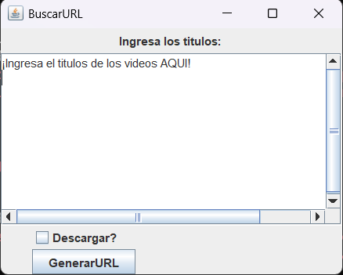

# MeindropDown
Herramienta de escritorio desarrollada en JRuby para buscar videos de YouTube por título, generar sus URLs y descargarlos mediante yt-dlp.
---
## Motivación

mi proyecto personal que hice por una necesidad sencilla "descargar múltiples videos de youtube escribiendo los títulos" esto tan simple como suena es algo que no pude encontrar en otros programas ya existentes o páginas de internet conocidas.

URL -> Program common -> descargar -> repetir

el principal problema que tenia es el primer paso "conseguir la URL del video a descargar", cuando es 1 a 10 vídeos es muy fácil aunque no muy rapido (casos personales casuales) pero en mi caso 70 a más en menos de 1 hora buscando Clips y recursos visuales se volvió problemático, ya con 100 o más es horrible de forma manual por lo que me vi obligado a buscar soluciones (no encontre ninguna asi que decidí crear mi solución)

## Características

- Buscar videos por título
- Obtener URL automáticamente
- Descargar múltiples videos
- Integración con yt-dlp
- Interfaz gráfica Swing
<!--  -->

## Capturas

## Instalación

1. Descargar la última versión desde Releases.
2. Extraer el contenido.
3. Descargar yt-dlp.
4. Copiar yt-dlp.exe en la carpeta raíz. 
5. Crear key.env (para más información ver config/readme.md).
6. Ejecutar meindropDown.exe. 

## USO

- ejecutar meindropDown.exe
- escribir los titulos
- opcional click en checkbox "descargar?" para descargar automaticamente
- en caso de no hacer click en checkbox "descargar?" entonces solo se generan las URL dentro de list.txt

## Ejemplo

Entrada:

Rick Astley Never Gonna Give You Up
Take On Me

Resultado:

https://youtube.com/watch?v=...
https://youtube.com/watch?v=...

---

### Lenguajes usados 
- Jruby 

¿Por qué JRuby?

Principalmente por Swing.
Necesitaba una interfaz gráfica rápida de desarrollar y JRuby me permite acceder directamente al ecosistema Java sin abandonar Ruby.

igualmente tengo en mente más adelante agregar nuevos GUI mientras aumenta mi experiencia en el uso de otros frameworks.

## Dependencias externas

El proyecto requiere:

- [Yt-dlp](https://github.com/yt-dlp/yt-dlp) -> aqui lo uso para descargar los videos, es necesario descargarlo y copiar el Yt-dlp.exe en la raíz del proyecto

- depende estrictamente de la API_KEY de youtube (mas informacion config/readme.md)

Por motivos de distribución y configuración personal, ninguno de estos elementos se incluye en los releases.

> meindropDown/
  |--> config/
  |--> controller/
  |--> model/
  |--> view/
  |--> main.rb
  |--> meindropDown.exe
  |--> yt-dlp.exe <-- HERE PASTE
  
### Entorno de desarrollo
jruby 10.0.2.0 (3.4.2)
java 24.0.2

debería funcionar bien con otras versiones.

#### ¿Plataforma?
 Limitaciones

- Probado únicamente en Windows 11
- Linux no ha sido validado
- macOS no soportado actualmente

#### ROADMAP

- [x] Generar URLs
- [X] Descargar Videos
- [ ] refactorizar
- [ ] Test y TDD
- [ ] Agregar nuevas features (audio only, carpeta de destino, playlist, limite de velocidad, etc)
- [ ] Agregar nuevos frontends usando frameworks mas modernos
- [ ] migrar todo a un lenguaje compilado sin VM

---
##### LICENCIA

MIT License

---
## Estado

Proyecto funcional y en mantenimiento ocasional.

Actualmente cubre el caso de uso para el que fue creado originalmente.
---
## Notas de desarrollo

Este proyecto fue desarrollado para resolver una necesidad personal y priorizó la velocidad de implementación sobre otros objetivos.

Durante el desarrollo se utilizaron herramientas de IA para depuración, resolución de problemas relacionados con APIs y consultas puntuales sobre JRuby y Java.

Es posible encontrar fragmentos de código o comentarios generados con asistencia de IA.

